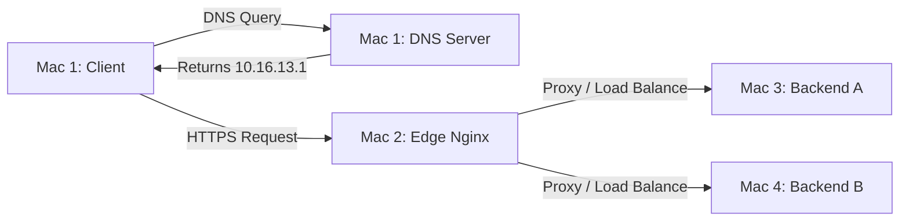
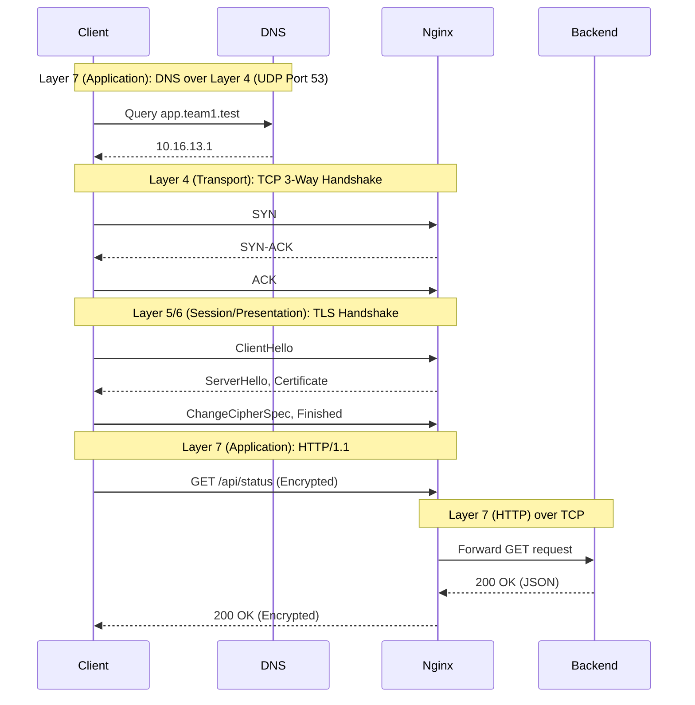

# Architecture Document

## Machine Roles and IP / Service Table

| Machine | Owner | Primary Role | IP Address | Services Running |
|---------|-------|--------------|------------|------------------|
| **Mac 1** | Friend | Private DNS Server & Test Client | `10.16.13.239` | dnsmasq, curl |
| **Mac 2** | Akshith | Edge / Reverse Proxy & Load Balancer | `10.16.13.1` | nginx, TLS (443) |
| **Mac 3** | Mohit | Backend Server A | `10.16.13.37` | Node.js / Express (3001) |
| **Mac 4** | Jayadeep | Backend Server B | `10.16.13.71` | Node.js / Express (3002) |

## Network Topology Diagram

## Request-Flow Diagram showing each protocol layer

